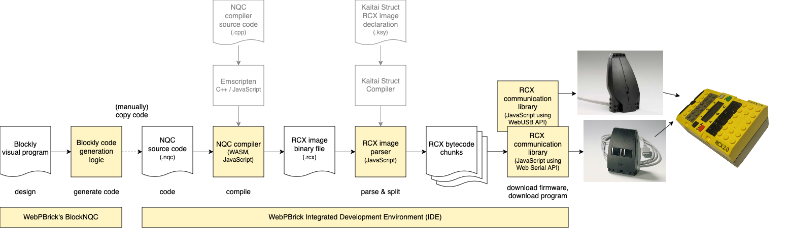

# README

This git repository provides the source codes for the **WebPBrick** project and hence the [webpbrick.com](http://webpbrick.com) website.


## Languages

WebPBrick is currently available in English (_en_) and Brazilian Portuguese (_ptbr_).

Huge thanks to GitHub user [Jonnhey](https://github.com/Jonnhey), who has not only translated the [README](./README_PTBR.md) file but also the screenshots, the whole IDE and all messages in the source code files!


## WebPBrick How To

1. Write NQC code _(or use BlockNQC to generate the code)_
2. Build your NQC code (click the "Build" button)
3. Connect to the yellow programmable RCX brick using an infrared tower (click the "Serial Connect" button)
4. Download your compiled program to the RCX (click the "Download program to RCX" button)


## WebPBrick's BlockNQC

A web-based visual programming editor called BlockNQC can be used to generate NQC code. BlockNQC is based on Google's Blockly. For details, see BlockNQC's separate [README](./nqc/blocknqc/README.md) file.


## Toolchain modules



WebPBrick's toolchain consists of several modules:

* BlockNQC: Web-based visual programming editor called BlockNQC that can be used to generate NQC code (based on Google's Blockly).
* WebNQC: The NQC compiler built as WebAssembly (WASM) for the web using emscripten.
* RCX image parser written in Kaitai Struct and compiled to JavaScript to parse and split RCX image binary files so that they can be downloaded to the RCX in their bytecode chunks.
* RCX communication libraries:
  * Based on Web Serial API to be used with the LEGO IR Serial Tower and [DIY IR serial towers](https://github.com/maehw/DiyIrTower)
  * Based on WebUSB API to be used with LEGO IR USB Tower

Those modules could be used independently.

## Run

Start a local webserver, e.g. using Python:

```shell
python3 -m http.server 8080
```

Open your web browser and navigate to http://localhost:8080/src/ide/


## Licenses

This project is a collection of modules and open source software. 

| Module                                                   | License                                                                     |
|----------------------------------------------------------|-----------------------------------------------------------------------------|
| NQC / WebNQC                                             | [Mozilla Public License 2.0](./nqc/webnqc/LICENSE.md)                       |
| NQC example code by D. Baum and R. Zurcher               | [Freeware License](./nqc/examples/def-guide-to-lego-mindstorms/LICENSE.txt) |
| Blockly (required for BlockNQC)                          | [Apache License 2.0](./nqc/blocknqc/blockly/LICENSE)                        |
| all others WebPBrick modules (e.g. BlockNQC and the IDE) | [GNU GPLv3](./LICENSE)                                                      |


## Released versions

Please find the CHANGELOG [here](./CHANGELOG.md). Please also note that WebPbrick.com may not be up-to-date with this repository on GitHub.

## Disclaimer

LEGO® is a trademark of the LEGO Group of companies which does not sponsor, authorize or endorse this project.
