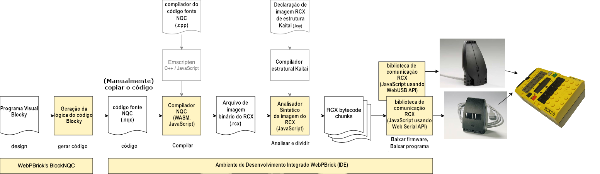

# LEIA-ME

Este repositório Git fornece os códigos-fonte do projeto **WebPBrick** e, consequentemente, do site [webpbrick.com](http://webpbrick.com).

## Como usar o WebPBrick

1. Escreva o código NQC (ou use o BlockNQC para gerar o código)
2. Compile seu código NQC (clique no botão "Compilar")
3. Conecte-se ao bloco RCX programável amarelo usando uma torre infravermelha (clique no botão "Conectar Serial")
4. Transfira seu programa compilado para o RCX (clique no botão "Transferir programa para o RCX")


## BlockNQC do WebPBrick

Um editor de programação visual baseado na web chamado BlockNQC pode ser usado para gerar código NQC. O BlockNQC é baseado no Blockly do Google. Para mais detalhes, consulte o arquivo [README](./nqc/blocknqc/README.md) separado do BlockNQC.


## Módulos da cadeia de ferramentas



A cadeia de ferramentas do WebPBrick consiste em vários módulos:

* BlockNQC: Editor de programação visual baseado na web chamado BlockNQC, que pode ser usado para gerar código NQC (baseado no Blockly do Google).

* WebNQC: O compilador NQC construído como WebAssembly (WASM) para a web usando o Emscripten.

* Analisador de imagens RCX escrito em Kaitai Struct e compilado para JavaScript para analisar e dividir arquivos binários de imagem RCX, de forma que possam ser baixados para o RCX em seus blocos de bytecode.

* Bibliotecas de comunicação RCX:

* Baseadas na API Web Serial para uso com a Torre Serial IR da LEGO e [torres seriais IR DIY](https://github.com/maehw/DiyIrTower)

* Baseadas na API WebUSB para uso com a Torre USB IR da LEGO

Esses módulos podem ser usados ​​independentemente.

## Executar

Inicie um servidor web local, por exemplo, usando Python:

```shell
python3 -m http.server 8080
```

Abra seu navegador e acesse http://localhost:8080/src/ide/

## Licenças

Este projeto é uma coleção de módulos e software de código aberto.

| Módulo | Licença |
|----------------------------------------------------------|-----------------------------------------------------------------------------|
| NQC / WebNQC | [Mozilla Public License 2.0](./nqc/webnqc/LICENSE.md) |
| Código de exemplo NQC por D. Baum e R. Zurcher | [Licença Freeware](./nqc/examples/def-guide-to-lego-mindstorms/LICENSE.txt) |
| Blockly (necessário para BlockNQC) | [Licença Apache 2.0](./nqc/blocknqc/blockly/LICENSE) |
| todos os outros módulos WebPBrick (por exemplo, BlockNQC e a IDE) | [GNU GPLv3](./LICENSE) |

## Versões lançadas

Consulte o CHANGELOG [aqui](./CHANGELOG.md). Observe também que o WebPbrick.com pode não estar atualizado com este repositório no GitHub.

## Aviso Legal

LEGO® é uma marca registrada do Grupo LEGO de empresas, que não patrocina, autoriza ou endossa este projeto.